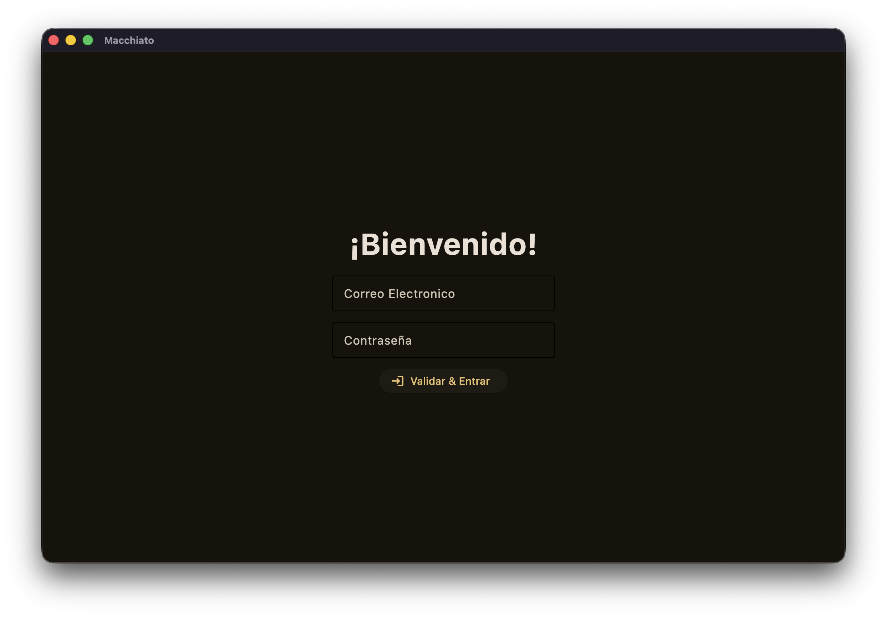
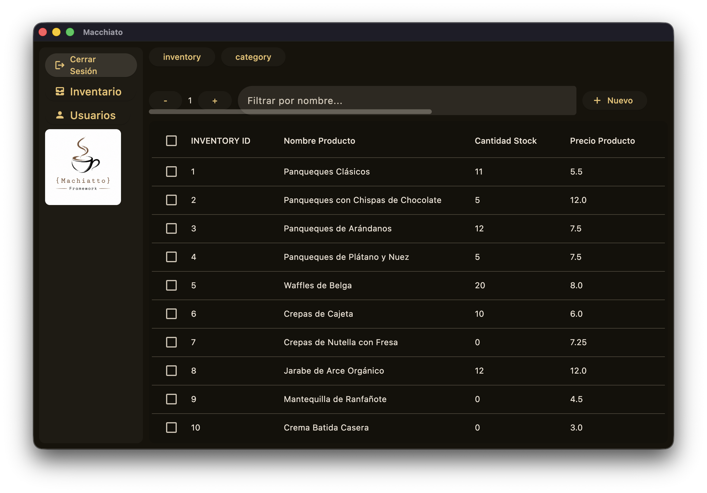
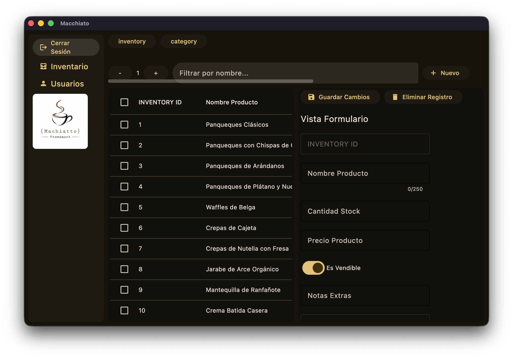
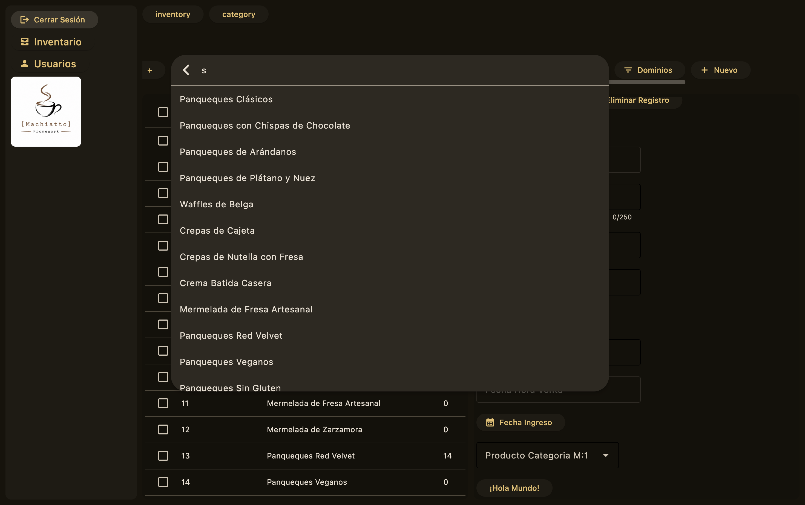
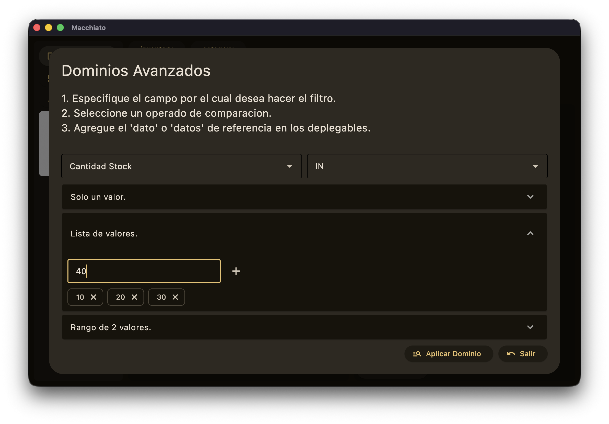

# ¡Bienvenido a Machiatto!


**Machiatto** es un motor de codigo abierto pensado para la construcción rápida de software `aplicación` para pequeñas y medianas empresas. En la actualidad **machiatto** utiliza como motor de bases de datos `Sqlite3` impulsado por `PanCakesORM` como el cerebro de coordinación de modelos y logica de consultas y relaciones. El `frontend` de **machiatto** esta montado sobre componentes `Flet`, los cuales han sido construidos para representar modelos, brindando vistas de tipo `Tabla-Formulario`. 

Es debido a todo lo anterior que `Machiatto Framework` requiere puramente de `Python3+`, olvidate de `HTML`, `CSS`, `JavaScript`, `SQL`, o algun otro lenguaje para la construccion de aplicaciones, con `Machiatto` tendras una caja de herramientas poderosa para la construcción de software empresarial.

## Graphic User Interface

**Machiatto** aprovehca la belleza del material design para entregar una GUI responsiva, optimizada, y limpia.




**Machiatto** & **PanCakesORM** trabajan en conjunto para un componente ideal para renderizar tablas. `DatatableORM` permite vistas `tabla-formulario`, busquedas y dominios avanzados (Filtrar Registros). Así mismo la inyección de componentes iterpretados por el componente al instancias de las `dataclasses` construidas para el `framework`.





## Inicion Rapido ☕

### Configuración

_Suponiendo que se haya usando una distribución linux. De lo contrario hacer lo mismo usando los comandos de Windows._

1. Activar entorno virtual

```bash
python3 -m venv .venv
```

2. Activar entorno

```bash
source .venv/bin/activate
```

3. Instalar dependencias

```bash
pip install -r requirements/requirements.txt
```

4. Utilizar un `.env` para configuraciones globales de su proyecto (Mismas para PanCakesORM).

```env
# Solo Configuración Machiatto

ADMIN=admin
ADMIN_PASSWORD=admin
ADMIN_EMAIL=ejemplo@gmail.com
```

### Jerarquia de directorios 🏗️ 

**Machiatto** busca todos sus modulos dentro del directorio packages que trae por defecto el repositorio. Ademas tanto `.env` como la validacion de credenciales dependen del modulo pre-cargado `users`. Es vital mantenerlo o de lo contrario ajustarlo para cualquier necesidad de desarrollo.

```txt
Machiatto
├── assets
│   ├── banner.png
│   └── images/
│       └── pictures...
├── machiatto
│   ├── datatable_orm.py # Componente vista-formulario
│   ├── machiatto_dataclasses.py # Controladores Personalizados Disponibles
│   ├── machiatto_gear.py # Construye el shell de la aplicación
│   └── package_loader.py # Carga de modulos e importacion de modelos.
├── packages
│   └── user/
│       ├── backend/ # Construcción de logica y componentes
│       ├── models/ # Modelos PanCakesORM
│       ├── views/ # Montar vistas
│       └── __manifest__.py
├── README.md
└── requirements/
    ├── requirements.txt # Obligatorio para el funcionamiento
    └── requirements-dev.txt # Solo para desarrollo
```

### Modulos

Para construir un modulo se recomienda la siguiente estructura:

```txt
user/
├── backend/
├── models/
├── views/
└── __manifest__.py
```

### Manifest

**Machiatto** depende de un `__manifest__.py` para montar modulos y vistas, construir una barra de navegación y cargar los modelos en la base de datos.

A continuacion se ejemplifica el uso del manifest:

```python
PACKAGE = {
    "name": "inventory",  # Nombre del modulo.
    "menu":  # Montar el modulo. (Barra de navegación lateral).
        {
        "label": "Inventario",
        "path": "packages.inventory.views.items",
        "icons": "all_inbox",
        "function": "default"
        },
    "container": {  # Vistas, ruta al fichero, "Callable" regresa una vista de flet.
        "packages.inventory.views.items": ["inventory", "category"]
        },
    "models": [  # Los modelos de este modulo.
        {
        "Inventory": "packages.inventory.models.inventory",
        "Category": "packages.inventory.models.category"
        },
    ]
}
```
