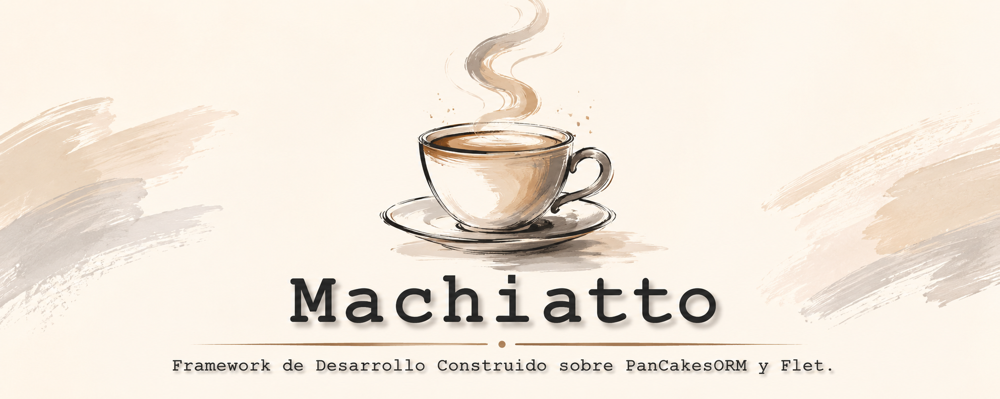
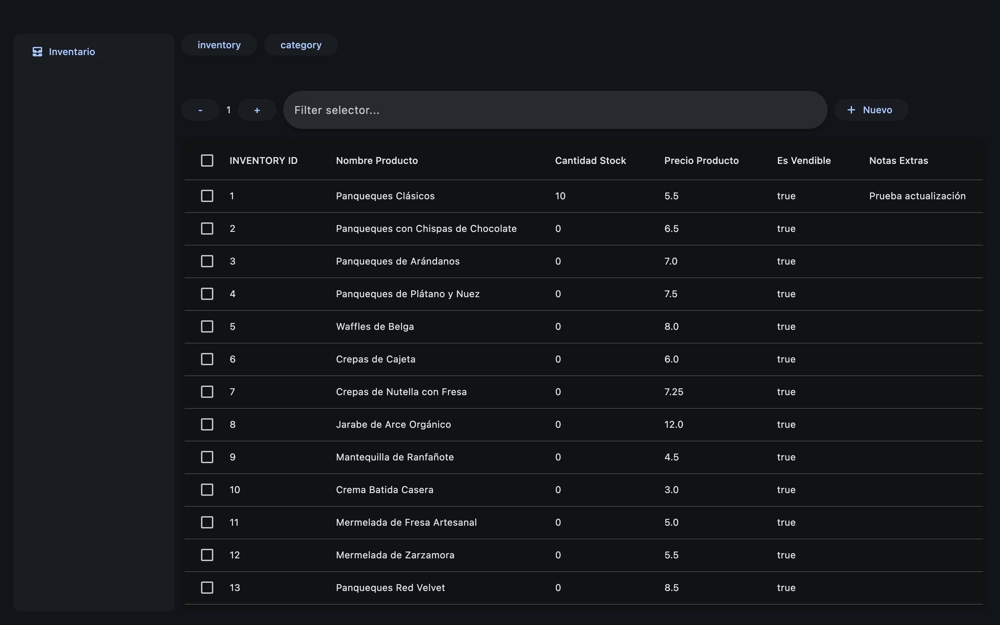

# ¡Bienvenido a Machiatto!



**Machiatto** es un motor de codigo abierto pensado para la construcción rápida de software `aplicación` para pequeñas y medianas empresas. En la actualidad **machiatto** utiliza como motor de bases de datos `Sqlite3` impulsado por `PanCakesORM` como el cerebro de coordinación de modelos y logica de consultas y relaciones. El `frontend` de **machiatto** esta montado sobre componentes `Flet`, los cuales han sido construidos para representar modelos, brindando vistas de tipo `Tabla-Formulario`. 

Es debido a todo lo anterior que `Machiatto Framework` requiere puramente de `Python3+`, olvdidate de `HTML`, `CSS`, `JavaScript`, `SQL`, o algun otro lenguaje para la construccion de aplicaciones, con `Machiatto` tendras una caja de herramientas poderosa para la construcción de software empresarial.

## Inicion Rapido

### Manifest

**Machiatto** depende de un `__manifest__.py` para montar modulos y vistas, construir una barra de navegación y cargar los modelos en la base de datos.

A continuacion se ejemplifica el uso del manifest:

```python
PACKAGE = {
    "name": "inventory",  # Nombre del modulo.
    "menu":  # Montar el modulo. (Barra de navegación lateral).
        {
        "label": "Inventario",
        "path": "packages.inventory.views.items",
        "icons": "all_inbox",
        "function": "default"
        },
    "container": {  # Vistas, ruta al fichero, "Callable" regresa una vista de flet.
        "packages.inventory.views.items": ["inventory", "category"]
        },
    "models": [  # Los modelos de este modulo.
        {
        "Inventory": "packages.inventory.models.inventory",
        "Category": "packages.inventory.models.category"
        },
    ]
}
```

## Graphic User Interface

**Machiatto** aprovehca la belleza del material design para entregar un una GUI responsiva, optimizada, y limpia.



## 🏗️ Jerarquía de directorios

```txt
machiatto
├── container.py
├── dataclasses.py
├── datatable_orm.py
├── gear.py
├── package_loader.py
└── search_bar_orm.py
``` 