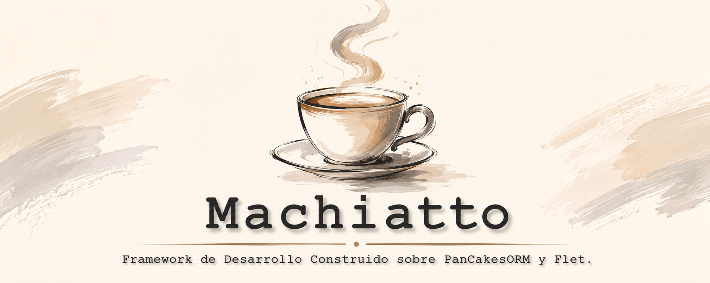
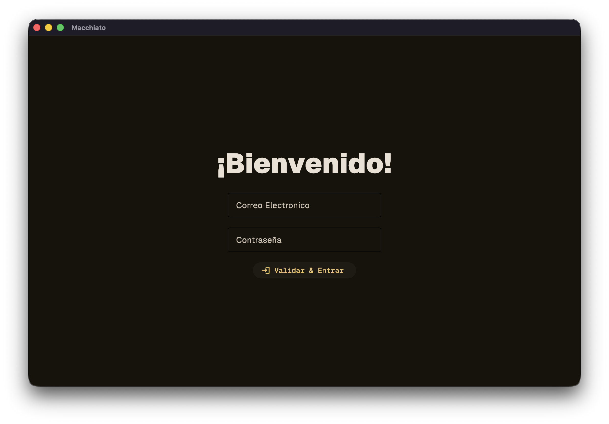
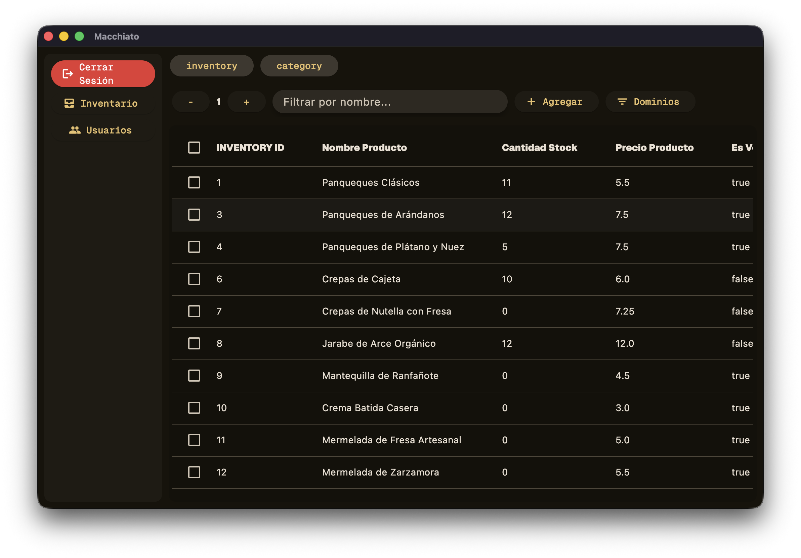
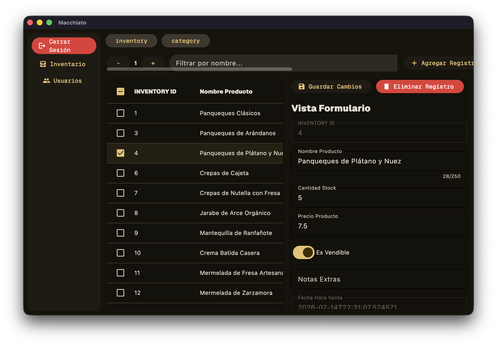
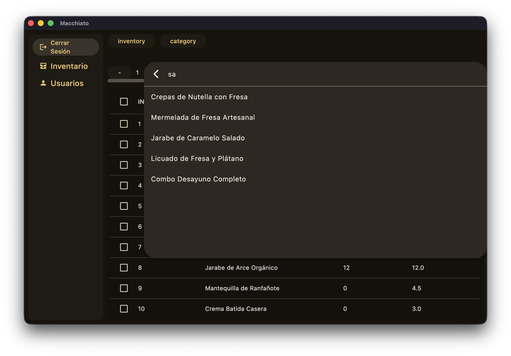
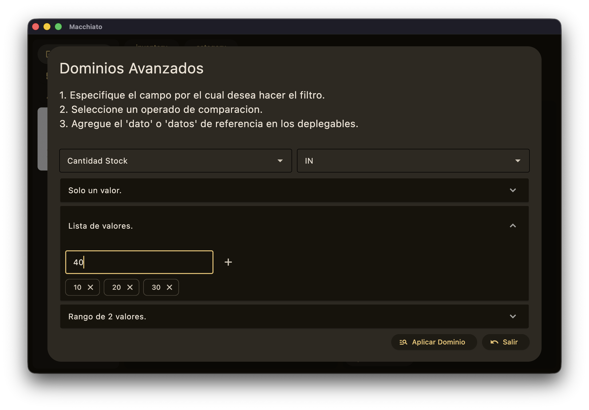

# ¡Bienvenido a Machiatto!



**Machiatto** es un motor de código abierto pensado para la construcción rápida de software `aplicación` para pequeñas  empresas. En la actualidad **machiatto** utiliza como motor de bases de datos `Sqlite3` impulsado por `PanCakesORM` como el cerebro de coordinación de modelos y lógica de consultas relacionales. El `frontend` de **machiatto** esta montado sobre componentes `Flet`, los cuales han sido construidos para representar modelos.

Se brindan vistas de tipo `Tabla-Formulario` así como componentes extras que podran ser estudiados en la documentación. 

Es debido a todo lo anterior que `Machiatto Framework` requiere puramente de `Python3+`, olvidate de `HTML`, `CSS`, `JavaScript`, `SQL`, o algun otro lenguaje para la construcción de aplicaciones, con `Machiatto` tendras una caja de herramientas poderosa para la construcción de software empresarial.

## Graphic User Interface

**Machiatto** aprovecha la belleza del material design para entregar una GUI responsiva, optimizada, y limpia.




**Machiatto** & **PanCakesORM** trabajan en conjunto creando un componente `DatatableORM` ideal para el renderizado de modelos. `DatatableORM` permite vistas `tabla-formulario`, busquedas y dominios avanzados. Así mismo se consideró la inyección de controladores `Flet` los cuales son interpretados por el componente al instanciar desde las `dataclasses` de `Machiatto Framework`.





### Índice de Tipografía

|Fuente|Tamaño|Elemento|
|------|------|--------|
|**GeistMonoMedium**|14|Botón|
|**GeistSansBlack**|22|Alerta Titulo|
|**GeistSansRegular**|14|Alerta Cuerpo|
|**GeistSansRegular**|14|Fuente por defecto|

## Inicio Rápido ☕

### Configuración

**ADVERTENCIA:** Las instrucciones a continuación funcionan para desarollo o despliegue en servidor. Sin embargo el Sistema Operativo óptimo para lo que se muestra a continuación es 'Linux' 🐧. En caso de querer desplegar en `Windows` se deberán seguir las mismas instrucciones adaptando los comandos `Shell de Windows`.

1. Crear entorno virtual

```bash
python3 -m venv .venv
```  

2. Activar entorno

```bash
source .venv/bin/activate
```

Sí se esta trabajando en un `Docker Python` no es necesaria la configuracion de los pasos `1` & `2` 🐳.

3. Instalar dependencias

```bash
pip install -r requirements/requirements.txt
```

4. Utilizar un `.env` para las configuraciones globales de sus proyectos.

```env
# Minima configuracion:

ADMIN=admin
ADMIN_PASSWORD=admin
ADMIN_EMAIL=ejemplo@gmail.com
DB_DIR=data
DB_FILE=db.sqlite
```

5. Correr el fichero `admin.sh`

¡Atención! Antes de correr el fichero `admin.sh` asegurar que el `.env` con credenciales y ruta a la base de datos esta creado con las `variables de entorno` definidas como se muestra en el ejemplo anterior `(paso 4)`. Tambien debe asegurarse de que el fichero `admin.sh` tiene permisos de ejecución.

Se puede asegurar de esto con:
```bash
# Dentro de la carpeta raiz 'Machiatto'.
sudo chmod +x ./admin.sh
```

6. Se podrá continuar al `paso 7` si obtiene el siguiente mensaje:

```bash
Configurando accesos administrador... 📦
"3.51.0 2025-06-12 13:14:41 f0ca7bba1c5e232e5d279fad6338121ab55af0c8c68c84cdfb18ba5114dcaapl (64-bit)"
Resolviendo las rutas... 🔦

        Evaluando en './.flet/storage/data/db/db.sqlite'
        

            La base de datos ya existe...
            Las credenciales estan congifuradas correctamente... 🔐
Accesos correctos en la base de datos... ✅

        Machiatto puede ser ejecutado con confianza... ☕
```

De lo contrario seguir las instrucciones en consola.

7. Es momento de correr su instancia de `Machiatto`. Basta con usar el siguiente comando:

```bash
# Puerto por defecto: 8000 de FastAPI
flet run --web --port 8000 app.py
```

### Adicionales de Despliegue

[Aplicación Flet Web](https://flet.dev/docs/publish/web/dynamic-website/)
[Variables de Entorno Flet Web](https://flet.dev/docs/reference/environment-variables)

### Para desarrollo

**Machiatto** busca todos sus modulos dentro del directorio packages que trae por defecto este repositorio. Ademas tanto `.env` como la validación de credenciales dependen del modulo pre-cargado `users`. Es vital mantener dicho modulo o de lo contrario ajustar para cualquier necesidad de desarrollo.

### Modulos

Para construir un modulo se recomienda la siguiente estructura:

```txt
user/
├── backend/
├── models/
├── views/
└── __manifest__.py
```

### Manifest

**Machiatto** depende de un `__manifest__.py` para montar modulos y vistas, construir una barra de navegación y cargar los modelos en la base de datos.

A continuacion se ejemplifica el uso del manifest:

```python
PACKAGE = {
    "name": "inventory",
    "menu":
        {
        "label": "Inventario",
        "path": "packages.inventory.views.menus",
        "icon": "all_inbox",
        "function": "main"
        },
    "container": {
        "packages.inventory.views.menus": ["inventory", "category"]
        },
    "models": [
        {
        "Inventory": "packages.inventory.models.inventory",
        "Category": "packages.inventory.models.category"
        },
    ]
}
```

### Jerarquia de directorios 🏗️ 

```txt
Machiatto
├── assets
│   ├── banner.png
│   └── images/
│       └── pictures...
├── machiatto
│   ├── datatable_orm.py # Componente vista-formulario
│   ├── machiatto_dataclasses.py # Controladores Personalizados Disponibles
│   ├── machiatto_gear.py # Construye el shell de la aplicación
│   └── package_loader.py # Carga de modulos e importacion de modelos.
├── packages
│   └── user/
│       ├── backend/ # Construcción de logica y componentes
│       ├── models/ # Modelos PanCakesORM
│       ├── views/ # Montar vistas
│       └── __manifest__.py
├── README.md
└── requirements/
    ├── requirements.txt # Obligatorio para el funcionamiento
    └── requirements-dev.txt # Solo para desarrollo
```